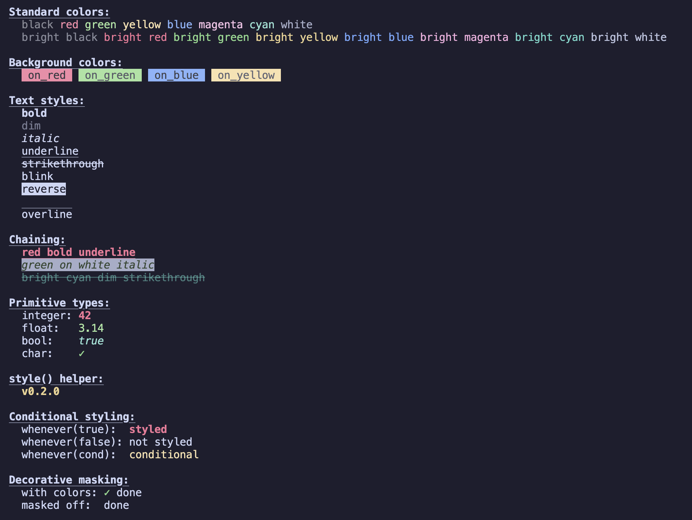

# 🎨 nanocolor

[](https://crates.io/crates/nanocolor)
[](https://docs.rs/nanocolor/latest/nanocolor/)

A minimal, zero-dependency terminal color and text styling crate for Rust.



Part of the nano crate family — minimal, zero-dependency building blocks for CLI apps in Rust:

- [nanocolor](https://github.com/anthonysgro/nanocolor) — terminal colors and styles
- [nanospinner](https://github.com/anthonysgro/nanospinner) — terminal spinners
- [nanoprogress](https://github.com/anthonysgro/nanoprogress) — progress bars
- [nanologger](https://github.com/anthonysgro/nanologger) — minimal logger
- [nanotime](https://github.com/anthonysgro/nanotime) — time utilities

ANSI 16-color support and common text styles through a chainable trait-based API — no heavy crates, no transitive dependencies, under 300 lines of code.

## Motivation

Most Rust color crates (like `colored`, `owo-colors`, or `yansi`) are feature-rich but can pull in dependencies or offer more than you need. If all you want is simple foreground/background colors and a few text styles, those crates are overkill.

`nanocolor` solves this by providing the essentials and nothing more:

- Zero external dependencies (only `std`)
- Tiny footprint (< 300 LOC)
- Chainable trait-based API on `&str` and `String`
- Style any `Display` type — integers, floats, booleans, chars
- Conditional styling and decorative masking
- Automatic TTY detection
- Respects the [NO_COLOR](https://no-color.org) standard

## Comparison

nanocolor is intentionally minimal. If you need 256-color, RGB, `no_std`, or advanced features like conditional closures and nested style wrapping, use `yansi` or `owo-colors` — they're great crates.

nanocolor is for when you just want colors and don't want to think about it.

| Feature | `nanocolor` | `yansi` | `owo-colors` | `colored` |
|---------|:-----------:|:-------:|:------------:|:---------:|
| Zero dependencies | ✓ | ✓ | ✓ | ✗ |
| 16 ANSI colors | ✓ | ✓ | ✓ | ✓ |
| 256 / RGB colors | ✗ | opt-in | ✓ | ✓ |
| Text styles (10) | ✓ | ✓ | ✓ | ✓ (5) |
| Style any `Display` type | ✓ | ✓ | ✓ | ✗ |
| Conditional per-value styling | ✓ | ✓ | ✗ | ✗ |
| Decorative masking | ✓ | ✓ | ✗ | ✗ |
| Global enable/disable | ✓ | ✓ | ✗ | ✓ |
| Auto TTY detection | ✓ | opt-in | ✗ | ✓ |
| `NO_COLOR` support | ✓ | opt-in | ✗ | ✓ |
| `no_std` support | ✗ | ✓ | ✓ | ✗ |
| Conditional closures | ✗ | ✓ | ✗ | ✗ |
| Wrap / linger quirks | ✗ | ✓ | ✗ | ✗ |
| Const style builders | ✗ | ✓ | ✗ | ✗ |
| Single file | ✓ | ✗ | ✗ | ✗ |
| Source lines of code | ~300 | ~1,200 | ~2,400 | ~1,100 |

## Features

- 16 foreground colors (8 standard + 8 bright)
- 16 background colors (8 standard + 8 bright)
- 5 text styles: bold, dim, italic, underline, strikethrough + 5 more (blink, reverse, hidden, overline, rapid blink)
- Chainable API — combine colors and styles freely
- Works with `&str`, `String`, and all primitive types (`i32`, `f64`, `bool`, `char`, etc.)
- `style()` helper for custom `Display` types
- Seamless `Display` integration — use in `println!`, `format!`, `write!`
- Conditional styling with `.whenever(bool)` — disable styling per-value
- Decorative masking with `.mask()` — hide values when colors are off
- Automatic TTY detection — ANSI codes are skipped when output is piped
- Global `enable()` / `disable()` to override auto-detection from code
- `NO_COLOR` environment variable support

## Quick Start

Add `nanocolor` to your project:

```sh
cargo add nanocolor
```

```rust
use nanocolor::Colorize;

fn main() {
    println!("{}", "error".red().bold());
    println!("{}", "warning".yellow());
    println!("{}", "success".green().on_black().underline());
}
```

## Usage

### Foreground colors

```rust
use nanocolor::Colorize;

println!("{}", "red text".red());
println!("{}", "bright cyan".bright_cyan());
```

### Background colors

```rust
println!("{}", "highlighted".on_yellow());
println!("{}", "bright bg".on_bright_blue());
```

### Text styles

```rust
println!("{}", "bold".bold());
println!("{}", "italic and underline".italic().underline());
println!("{}", "strikethrough".strikethrough());
```

### Chaining

Colors and styles can be chained in any order:

```rust
let styled = "important".red().on_white().bold().underline();
println!("{}", styled);
```

### Works with String

```rust
let msg = String::from("dynamic content");
println!("{}", msg.green().bold());
```

### Piped / non-TTY output

When stdout isn't a terminal (e.g. piped to a file or another program), `nanocolor` automatically skips ANSI codes and outputs plain text. No configuration needed.

You can also force colors off by setting the `NO_COLOR` environment variable:

```bash
NO_COLOR=1 my_tool
```

### Style any Display type

Integers, floats, booleans, and chars all support the same chainable API:

```rust
use nanocolor::Colorize;

println!("{}", 42.red().bold());
println!("{}", 3.14_f64.green());
println!("{}", true.cyan().italic());
println!("{}", '✓'.bright_green());
```

For custom types that implement `Display`, use the `style()` helper:

```rust
use nanocolor::{Colorize, style};

struct StatusCode(u16);
impl std::fmt::Display for StatusCode {
    fn fmt(&self, f: &mut std::fmt::Formatter<'_>) -> std::fmt::Result {
        write!(f, "{}", self.0)
    }
}

println!("{}", style(StatusCode(404)).red().bold());
```

### Conditional styling with `.whenever()`

Disable styling on a per-value basis, independent of the global TTY/NO_COLOR state:

```rust
use nanocolor::Colorize;

let is_tty = true; // your own condition
println!("{}", "warning".yellow().whenever(is_tty));

// .whenever(false) always strips ANSI codes
println!("{}", "plain".red().bold().whenever(false)); // prints "plain"
```

If `.whenever()` is called multiple times, the last call wins.

### Decorative masking with `.mask()`

Mark decorative values (emoji, symbols) so they disappear when colors are off — keeping piped output clean:

```rust
use nanocolor::Colorize;

// When colors are on:  "✓ passed"
// When colors are off: " passed"  (the checkmark is hidden)
print!("{}", "✓ ".green().mask());
println!("passed");
```

`.mask()` and `.whenever()` compose naturally:

```rust
use nanocolor::Colorize;

// Always hidden (whenever(false) forces styling off)
println!("{}", "🎨".mask().whenever(false)); // prints ""

// Shown only when colors are active
println!("{}", "🎨".mask().whenever(true));
```

### Global enable / disable

Override auto-detection from code — useful for CLI apps with a `--no-color` flag:

```rust
fn main() {
    let args: Vec<String> = std::env::args().collect();
    if args.contains(&"--no-color".to_string()) {
        nanocolor::disable();
    }

    // All styled output now respects the override
    println!("{}", "hello".red().bold());
}
```

You can also force colors on with `nanocolor::enable()`.

## Available Colors

| Standard | Bright |
|----------|--------|
| `black()` | `bright_black()` |
| `red()` | `bright_red()` |
| `green()` | `bright_green()` |
| `yellow()` | `bright_yellow()` |
| `blue()` | `bright_blue()` |
| `magenta()` | `bright_magenta()` |
| `cyan()` | `bright_cyan()` |
| `white()` | `bright_white()` |

All colors have background variants with the `on_` prefix (e.g. `on_red()`, `on_bright_cyan()`).

## Available Styles

| Method | Effect |
|--------|--------|
| `bold()` | Bold text |
| `dim()` | Dimmed text |
| `italic()` | Italic text |
| `underline()` | Underlined text |
| `blink()` | Blinking text (terminal support varies) |
| `rapid_blink()` | Rapid blinking text (rarely supported) |
| `reverse()` | Swap foreground and background |
| `hidden()` | Invisible text (still takes space) |
| `strikethrough()` | Strikethrough text |
| `overline()` | Line above text (newer terminals) |

## Contributing

Contributions are welcome. To get started:

1. Fork the repository
2. Create a feature branch (`git checkout -b my-feature`)
3. Make your changes
4. Run the tests: `cargo test`
5. Submit a pull request

Please keep changes minimal and focused. This crate's goal is to stay small and dependency-free.

## License

This project is licensed under the [MIT License](LICENSE).
